项目参考教程：[【C++游戏开发之旅2】幽灵逃生 up: ZiyuGameDev ](https://www.bilibili.com/video/BV1jf9XYQEhW)

写一些笔记，记录一下学习过程

项目使用C++语言，cmake打包，使用SDL3库进行游戏开发，浅显地用到glm向量库。
主要使用继承，子类将自身加入父类（Object、Sceen）,作为children, 由父类调用children的update、render、clean函数，实现更新渲染和生命周期管理。
完成项目的过程中，通过写代码，对C++的引用，指针，数据类型，语法等有了一定的了解，自我感觉达到了C++初级水平。
对SDL3库的使用，对游戏开发有了初步的了解。初步理解游戏开发中的精灵图、碰撞盒、特效、UI、事件响应、音乐、文件读取和保存等。对游戏中一些功能的实现有了了解，比如方向向量归一化，渲染坐标、世界坐标实现相机跟随、网格背景和视差背景等，以及游戏基本的组件分类和实现。

继承太深了，梳理下继承链

```mermaid
classDiagram
    %% 定义继承关系
    main o-- Game
    Object <|-- Game
    Object <|-- Scene
    Object o-- Game
    Game o-- AssetStore
    

    Scene <|-- SceneMain
    Scene <|-- SceneTitle

    Object <|-- ObjectScreen
    ObjectScreen <|-- ObjectWorld
    ObjectScreen <|-- HUDSkill
    ObjectScreen <|-- HUDText
    ObjectScreen <|-- UI_Mouse
    ObjectScreen <|-- HUDButton
    ObjectScreen <|-- HUDStats

    ObjectWorld <|-- Actor
    Actor <|-- Player
    Actor <|-- Enemy
    ObjectWorld <|-- Spell
    ObjectWorld <|-- Effect

    Object <|-- ObjectAffiliate
    ObjectAffiliate <|-- Sprite
    Sprite <|-- SpriteAnim
    ObjectAffiliate <|-- Collider
    ObjectAffiliate <|-- TextLabel
    ObjectAffiliate <|-- AffiliateBar

    Object <|-- Stats
    Object <|-- Weapon
    Weapon <|-- WeaponThunder
    Object <|-- Spawner
    Object <|-- BgStars
    Object <|-- Timer

    %% 定义类成员 (可选)
    class Object{
        #std::vector<Object *> children_
        #Game &game_
        +virtual void init()
        +virtual bool handleEvents(SDL_Event &)
        +virtual void update(float)
        +virtual void render()
        +virtual void clean()
    }
    class main["main.cpp"]{
        -Game
    }
    class Game["Game (单例)"]{
        #Scene *current_scene_
        #Scene *next_scene_
        #glm::vec2 screen_size_
        #SDL_Window *window_
        #SDL_Renderer *renderer_
        #AssetStore *asset_store_
        #TTF_TextEngine *ttf_engine_
        #bool is_running_
        #Uint64 FPS_
        #SDL_MouseButtonFlags mouseButtonFlags_
        #glm::vec2 mouse_screen_pos_
        #int score_

        +void init()
        +void run()
        +void clean()
        +void handleEvents()
        +void update(float dt)
        +void render()
        +void changeScene(Scene *scene)
    }
    class Scene{
        #glm::vec2 wordSize_
        #glm::vec2 cameraPos_
        #std::vector<ObjectWorld *> children_world_
        #std::vector<ObjectScreen *> children_screen_
        #UI_Mouse *ui_mouse_
    }
    class SceneMain{
        #Player *player_
        #Spawner *spawner_
        #HUDStats *player_stats_hud_bar_
        #HUDText *score_hud_text_
        #HUDButton
    }
    class SceneTitle{
        #HUDText
        #HUDButton
    }
    class ObjectScreen{
        #glm::vec2 screen_pos_
    }
    class ObjectWorld{
        #Collider *collider_
        #glm::vec2 position_
        +virtual void takeDamage(float)
    }
    class Actor{
        #glm::vec2 velocity_
        #float max_speed_
        #bool is_moving_
        #Stats *stats_
        #AffiliateBar *health_bar_
        +void move(float dt)
    }
    class Player{
        #SpriteAnim
        #WeaponThunder
    }
    class Stats{
        #float current_health_
        +createAddChild()
    }
    class Collider{
        #Type type_
        #SDL_Texture *texture_
        +createAddChild()
    }
    class ObjectAffiliate{
        #glm::vec2 size_
        #float scale_
        #ObjectScreen *parent_
        #glm::vec2 offset_
        #Anchor anchor_
    }
    class Sprite{
        #ImageTexture *imageTexture_
        #bool is_finish_
        #glm::vec2 percent_
        +createAddChild()
    }
    class SpriteAnim{
        #int currentFrame_
        #int totalFrame_
        #int FPS_
        #float frameTimer_
        #bool is_loop_
        +createAddChild()
    }
    class AffiliateBar{
        #float percent_
        #SDL_FColor
        +createAddChild()
    }
    class Enemy{
        #Player *target_
        #State current_state_
        #SpriteAnim
    }

    class UI_Mouse{
        #Sprite
        +createAddChild()
    }
    class HUDText{
        #Sprite *sprite_bg_
        #TextLabel *text_label_
        #glm::vec2 size_;
        +createAddChild()
    }
    class TextLabel{
        #TTF_Text *ttf_text_
        #float font_size_
        #std::string font_path_
        +createAddChild()
    }
    class HUDButton{
        #Sprite
        #bool is_hover_
        #bool is_pressed_
        #bool is_trigger_
        +createAddChild()
    }
    class Spawner{
        #int num_
        #float timer_
        #float interval_
        -Effect
        -Enemy
    }
    class Effect{
        #SpriteAnim *spriteAnim_
        #Object *nextObject_
        +createAddChild()
    }
    class HUDStats{
        #Sprite
        #Actor
        +createAddChild()
    }
    class HUDSkill{
        #Sprite *icon_
        #float percent_
        +createAddChild()
    }
    class Spell{
        #SpriteAnim *sprite_anim_
        #float damage_
        +createAddChild()
    }

    class Weapon{
        #Actor * parent_
        #float cooldown_time_
        #int cost_mana_
    }
    class WeaponThunder{
        #HUDSkill *hud_skill_
        -float demage_
        -Spell
        +createAddChild()
    }
    class BgStars {
        +createAddChild()
    }
    class AssetStore{
        #imageMap_
        #musicMap_
        #chunkMap_
        #fontMap_
    }
    class Timer{
        +createAddChild()
    }

    note for Object "include def.h 存枚举类，宏等"

```

