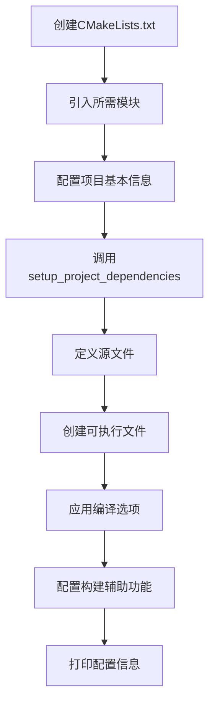

# CMake 模块快速参考

## 🚀 快速开始

### 在新项目中使用这些模块

1. **复制cmake文件夹**到你的项目根目录
2. **在CMakeLists.txt中引入模块**：

```cmake
cmake_minimum_required(VERSION 3.10.0)
project(YourProject VERSION 1.0.0)

# 引入模块
include(cmake/CompilerSettings.cmake)
include(cmake/RuntimePath.cmake)
include(cmake/Dependencies.cmake)
include(cmake/ImGui.cmake)
include(cmake/BuildHelpers.cmake)
include(cmake/ProjectInfo.cmake)

# 使用模块
set(TARGET YourApp)
setup_project_dependencies()
add_executable(${TARGET} main.cpp)
setup_compiler_options(${TARGET})
setup_asset_copy(${TARGET})
setup_windows_dll_copy(${TARGET})
print_project_info(${TARGET})
```

## 📋 常用函数速查

| 函数名 | 所在模块 | 用途 | 示例 |
|--------|---------|------|------|
| `setup_compiler_options()` | CompilerSettings | 设置编译选项 | `setup_compiler_options(${TARGET})` |
| `setup_project_dependencies()` | Dependencies | 配置所有依赖 | `setup_project_dependencies()` |
| `find_or_fetch_dependency()` | Dependencies | 添加单个依赖 | 见下方 |
| `setup_asset_copy()` | BuildHelpers | 复制资源文件 | `setup_asset_copy(${TARGET})` |
| `setup_windows_dll_copy()` | BuildHelpers | 复制DLL | `setup_windows_dll_copy(${TARGET})` |
| `print_project_info()` | ProjectInfo | 打印配置信息 | `print_project_info(${TARGET})` |

## 🔧 添加依赖的三种方式

### 方法1: 修改setup_project_dependencies()
**推荐用于永久依赖**

编辑 `cmake/Dependencies.cmake`：
```cmake
function(setup_project_dependencies)
    # ... 现有依赖 ...
    
    find_or_fetch_dependency(
        fmt              # 内部名称
        fmt              # 包名
        "https://github.com/fmtlib/fmt.git"
        "10.1.1"         # 版本
        "external/fmt"   # 本地路径
        STATIC           # 链接类型
    )
endfunction()
```

### 方法2: 直接在CMakeLists.txt中调用
**推荐用于临时或实验性依赖**

```cmake
include(cmake/Dependencies.cmake)

find_or_fetch_dependency(
    boost_filesystem
    Boost
    "https://github.com/boostorg/boost.git"
    "boost-1.83.0"
    "external/boost"
    AUTO
)
```

### 方法3: 使用系统包
**推荐用于标准库**

```cmake
find_package(OpenCV REQUIRED)
target_link_libraries(${TARGET} opencv_core)
```

## 🎨 链接类型说明

| 类型 | 说明 | 适用场景 |
|------|------|----------|
| `STATIC` | 静态链接(.a/.lib) | 首选，无运行时依赖 |
| `SHARED` | 动态链接(.so/.dll/.dylib) | 减小可执行文件大小 |
| `AUTO` | 使用全局BUILD_SHARED_LIBS | 统一控制所有库 |

## 🔍 问题诊断

### CMake配置失败
```bash
cd build
rm -rf *          # 清空build目录
cmake ..          # 重新配置
```

### 依赖下载失败
1. 检查网络连接
2. 手动下载源码到external/目录
3. 使用国内镜像（修改GIT_REPO地址）

### 编译错误
```bash
cmake --build . --verbose  # 显示详细编译信息
```

## 📝 模块选择指南

### 我的项目需要哪些模块？

| 项目类型 | 必需模块 | 可选模块 |
|---------|---------|---------|
| 纯C++项目 | CompilerSettings | Dependencies, BuildHelpers |
| 跨平台游戏 | 全部 | - |
| 仅Windows | CompilerSettings, Dependencies, BuildHelpers (DLL) | RuntimePath |
| 仅Linux/macOS | CompilerSettings, Dependencies, RuntimePath | BuildHelpers (DLL) |
| 静态链接 | CompilerSettings, Dependencies | RuntimePath |

## 🎯 典型使用流程



## 💡 提示与技巧

### 1. 仅在需要时包含模块
```cmake
# 仅在Windows上包含DLL复制
if(WIN32)
    include(cmake/BuildHelpers.cmake)
    setup_windows_dll_copy(${TARGET})
endif()
```

### 2. 自定义依赖配置
```cmake
# 在调用setup_project_dependencies前设置
set(BUILD_SHARED_LIBS ON)  # 使用动态链接
setup_project_dependencies()
```

### 3. 覆盖默认配置
```cmake
# 在引入模块后修改
set(CMAKE_CXX_STANDARD 17)  # 改用C++17
```

### 4. 调试模块加载
```cmake
message(STATUS "Loading CompilerSettings...")
include(cmake/CompilerSettings.cmake)
message(STATUS "CompilerSettings loaded successfully")
```

